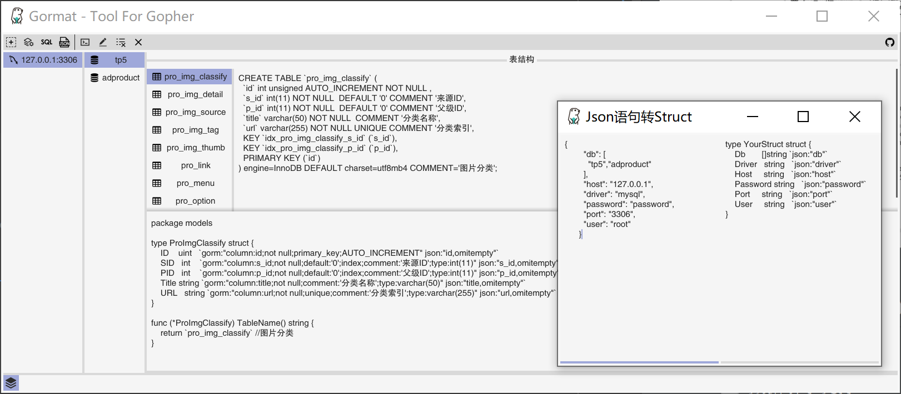

# Gormat - Cross platform gopher tool
           
> The golang convenient converter supports Database to Struct, SQL to Struct, and JSON to Struct.

 
 [](https://goreportcard.com/report/github.com/airplayx/gormat)
 [](https://codecov.io/gh/airplayx/gormat)
 [](https://codecov.io/gh/airplayx/gormat)
 [中文说明](README_ZH.md)



## Features

- [x] Database to Struct
    - [x] Data engine
        - [x] Mysql
    - [x] Auto save file
    - [x] Tags
        - [x] Gorm
        - [x] Xrom
        - [x] JSON
    - [x] Exclude list
    - [x] Data mapping
    - [x] Custom transformation
- [x] SQL to Struct
- [x] JSON to Struct

## About

In golang development, there are times when you need to tap the structure manually and store it manually.Although Gorm has the ability to migrate automatically, it does not form database fields effectively and ideally.There are also many open source examples on the web, but there are no user-friendly and easy-to-manage tools, so I started this project with the goal of more efficient development, conversion and ready-to-use.

This project borrows a lot of code from open source conversion libraries and makes some adjustments in conjunction with orm.There are many problems encountered in the development, and Fyne is a GUI development framework with many pits, which should not be further discussed.Whether it is a database to Struct or a Struct to SQL statement, there are still some errors, so the conversion results are only for reference, please adjust the use of the actual project.

### Prerequisites 

```
golang >= 1.11
```

### Installation 

No additional environment is required for installation and use, move to [releases](https://github.com/airplayx/gormat/releases) to download.

Different platforms need to install additional development environments.

OS X & Linux:
```sh
OpenSSL
```

Windows:

```sh
Gcc
```

### Usage example

``` golang
SET CGO_ENABLED=1
SET CC=x86_64-w64-mingw32-gcc
SET GOOS=windows
SET GOARCH=amd64
go build -o gormat.exe -ldflags="-H windowsgui"
```

In this project, Fyne is used for development. For more steps of packaging and compiling, please refer to [https://fyne.io/develop/distribution.html](https://fyne.io/develop/distribution.html)

## Contributing

    fyne.io/fyne
   	github.com/Chronokeeper/anyxml
   	github.com/CloudyKit/fastprinter
   	github.com/CloudyKit/jet
   	github.com/agrison/go-tablib
   	github.com/agrison/mxj
   	github.com/bndr/gotabulate
   	github.com/buger/jsonparser
   	github.com/chenhg5/collection
   	github.com/denisenkom/go-mssqldb
   	github.com/fatih/astrewrite
   	github.com/fatih/camelcase
   	github.com/fatih/structs
   	github.com/go-sql-driver/mysql
   	github.com/lib/pq
   	github.com/liudanking/gorm2sql
   	github.com/liudanking/goutil
   	github.com/mattn/go-sqlite3
   	github.com/pinzolo/casee
   	github.com/tealeg/xlsx
   	github.com/xormplus/builder
   	github.com/xormplus/core
   	github.com/xormplus/xorm
   	golang.org/x/net
   	golang.org/x/tools
   	gopkg.in/flosch/pongo2.v3
   	gopkg.in/yaml.v2
	
## Thanks

    github.com/hsyan2008/gom
    github.com/fatih/structtag
    github.com/yujiahaol68/sql2struct
    github.com/bashtian/jsonutils

## License
For the MIT agreement of this project, please click [LICENSE](LICENSE) for more details.

