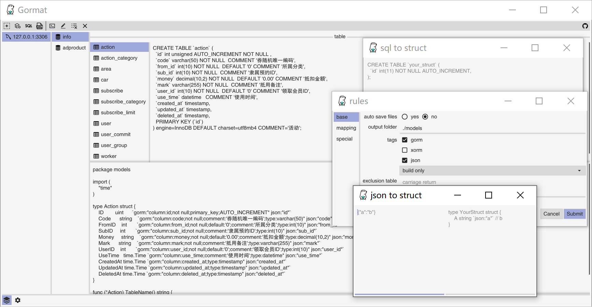

# Gormat - Cross platform gopher tool
           
> The golang convenient converter supports Database to Struct, SQL to Struct, and JSON to Struct.

 
 [](https://goreportcard.com/report/github.com/airplayx/gormat)
 [](https://codecov.io/gh/airplayx/gormat)
 [](https://github.com/airplayx/gormat/releases)
 [中文说明](README_ZH.md)



## Features

- [x] Database to Struct
    - [x] Data engine
        - [x] Mysql
    - [x] Auto save file
    - [x] Tags
        - [x] Gorm
        - [x] Xrom
        - [x] JSON
    - [x] Exclude list
    - [x] Data mapping
    - [x] Custom transformation
- [x] SQL to Struct
- [x] JSON to Struct

## About

In golang development, there are times when you need to tap the structure manually and store it manually.Although Gorm has the ability to migrate automatically, it does not form database fields effectively and ideally.There are also many open source examples on the web, but there are no user-friendly and easy-to-manage tools, so I started this project with the goal of more efficient development, conversion and ready-to-use.

This project borrows a lot of code from open source conversion libraries and makes some adjustments in conjunction with orm.There are many problems encountered in the development, and Fyne is a GUI development framework with many pits, which should not be further discussed.Whether it is a database to Struct or a SQL to Struct statement, there are still some errors, so the conversion results are only for reference, please adjust the use of the actual project.

### Prerequisites 

```
golang 1.11+
```

### Installation 

No additional environment is required for installation and use, move to [releases](https://github.com/airplayx/gormat/releases) to download.

Different platforms need to install additional development environments.

Linux and BSD:
```sh
Ubuntu / Debian: sudo apt-get install golang gcc libgl1-mesa-dev xorg-dev
Fedora: sudo dnf install golang gcc libXcursor-devel libXrandr-devel mesa-libGL-devel libXi-devel libXinerama-devel
Solus: sudo eopkg it -c system.devel golang mesalib-devel libxrandr-devel libxcursor-devel libxi-devel libxinerama-devel
Arch Linux: sudo pacman -S go xorg-server-devel
```

Windows:

```sh
Gcc
```

### Usage example

``` golang
SET CGO_ENABLED=1
SET CC=x86_64-w64-mingw32-gcc
SET GOOS=windows
SET GOARCH=amd64
go build -o gormat.exe -ldflags="-H windowsgui"
```

In this project, Fyne is used for development. For more steps of packaging and compiling, please refer to [https://fyne.io/develop/distribution.html](https://fyne.io/develop/distribution.html)

## Thanks

    github.com/hsyan2008/gom
    github.com/fatih/structtag
    github.com/yujiahaol68/sql2struct
    github.com/bashtian/jsonutils

## License
For the MIT agreement of this project, please click [LICENSE](LICENSE) for more details.

