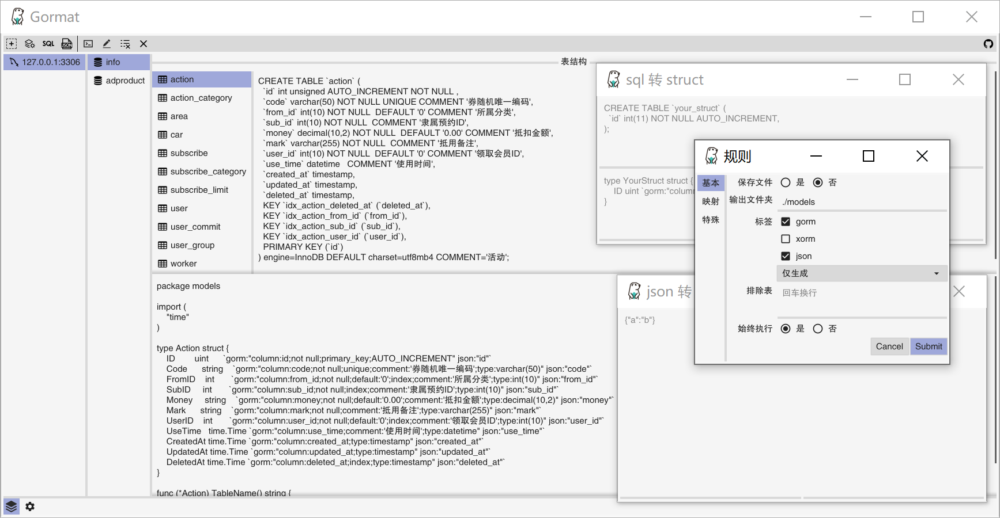

# Gormat - Gopher辅助工具

> golang便捷转换器，支持数据库转Struct、Sql转Struct、Json转Struct

  
 [](https://goreportcard.com/report/github.com/airplayx/gormat)
 [](https://codecov.io/gh/airplayx/gormat)
 [](https://github.com/airplayx/gormat/releases)
 [English](README.md)



## 功能展示

- [x] 数据库转Struct
    - [x] 数据引擎支持
        - [x] Mysql
    - [x] 自动存文件
    - [x] 标签支持
        - [x] Gorm
        - [x] Xrom
        - [x] JSON
    - [x] 排除列表
    - [x] 数据映射
    - [x] 自定义转型
- [x] Sql转Struct
- [x] Json转Struct

## 说明

在golang开发中，有很多时候需要手动敲结构体，并且需要手动入库。尽管gorm有自动迁移的功能，但并不能有效、理想化的形成数据库字段。
网上也有很多开源的例子，但是都没有界面化并且方便管理的工具，所以我开始写这个项目，目的就是更高效的开发，转换即用。

本项目借鉴了许多开源转换库的代码，并结合orm进行适度调整。在开发中遇到了很多的问题，fyne这个GUI开发框架也是有很多坑点的，现不赘述。不管是数据库转Struct，还是SQL转Struct语句，普遍还存在一些误差，所以转换结果仅供参考，
实际项目请自行调整使用。

### 开发条件

```
golang 1.11+
```

### 安装

安装使用不需要额外的环境，移步到[releases](https://github.com/airplayx/gormat/releases)下载。

不同平台需要安装额外的开发环境

Linux and BSD:
```sh
Ubuntu / Debian: sudo apt-get install golang gcc libgl1-mesa-dev xorg-dev
Fedora: sudo dnf install golang gcc libXcursor-devel libXrandr-devel mesa-libGL-devel libXi-devel libXinerama-devel
Solus: sudo eopkg it -c system.devel golang mesalib-devel libxrandr-devel libxcursor-devel libxi-devel libxinerama-devel
Arch Linux: sudo pacman -S go xorg-server-devel
```

Windows:

```sh
Gcc
```

### Windows编译示例

``` golang
SET CGO_ENABLED=1
SET CC=x86_64-w64-mingw32-gcc
SET GOOS=windows
SET GOARCH=amd64
go build -o gormat.exe -ldflags="-H windowsgui"
```

本项目使用fyne开发，更多打包编译步骤参考: [https://fyne.io/develop/distribution.html](https://fyne.io/develop/distribution.html)

## 鸣谢

    github.com/hsyan2008/gom
    github.com/fatih/structtag
    github.com/yujiahaol68/sql2struct
    github.com/bashtian/jsonutils

## 授权协议

这个项目 MIT 协议， 请点击 [LICENSE](LICENSE) 了解更多细节。
